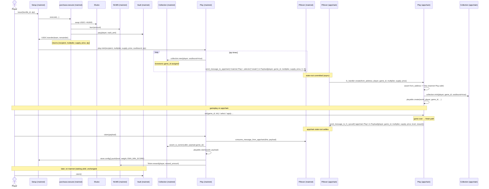

# Nums cross-chain bridge — architecture

## TL;DR

Nums runs on a TEE appchain. Mainnet handles economics; appchain handles
gameplay. Two thin, value-free Piltover messages connect the chains.

- **Forward (mainnet → appchain).** When a player pays for a bundle on
  mainnet, `Setup.issue` runs the existing inline economic flow
  (`swap + burn + vault.pay + team.transfer`), then calls `Play.mint`.
  `Play.mint` mints a `Collection` NFT on mainnet (assigning the
  monotonic `game_id`) and queues a Piltover message per unit. The
  appchain `Play.create` `#[l1_handler]` consumes the message, mints
  the same `Collection` NFT on the appchain (with the same `game_id`),
  and starts the game.
- **Reverse (appchain → mainnet).** When the player finishes a game on
  the appchain (`Play.set` / `Play.select` / `Play.apply` reaching the
  game-over state), `Playable.finish` queues a Piltover message back
  to mainnet — **no local NUMS mint, no local EMA write on the
  appchain**. On mainnet, anyone calls `Play.claim(payload)` which
  consumes the message, asserts the caller still owns the mainnet
  `Collection` NFT for `payload.game_id`, pushes the EMA, mints the
  per-game NUMS reward via `Token.reward`, and updates the token
  metadata.

No USDC bridge. No reserve. No swap reverts to recover from. The only
value at risk is the per-game NUMS reward if a reverse message gets
stuck (mitigated by operator monitoring; admin recovery via off-chain
proof is the documented ops procedure).

There is no "local-only" mode: a deployment without a Piltover
messaging address is rejected by `Setup.dojo_init` (the `Bridge` model
asserts the address is non-zero).

## Sequence diagram



## Cross-chain message format

A single, symmetric `Payload` type carries both directions. The Cairo
struct lives in `contracts/src/types/payload.cairo`:

```cairo
pub struct Payload {
    pub player: ContractAddress,
    pub game_id: u64,
    pub multiplier: u128,
    pub supply: u256,
    pub price: u256,
    pub level: u8,
    pub reward: u128,
}
```

Standard Cairo `Serde`. The relevant subset of fields per direction:

### Forward: `Play.create` (mainnet → appchain)

Sent by `Play.mint` on mainnet via `IMessaging::send_message_to_appchain`
with selector `selector!("create")`.

| Field | Forward usage |
|---|---|
| `player` | Recipient on the appchain (identity invariant: same controller across chains) |
| `game_id` | Game id assigned by mainnet `Collection.new`; reused as-is on the appchain `Collection.mint` to keep ownership consistent across chains |
| `multiplier` | Pre-computed by `Rewarder::multiplier` using the current EMA |
| `supply` | Snapshot of NUMS total supply at purchase time |
| `price` | Bundle price snapshot (USDC / quote token) |
| `level` | Unused on forward; set to `0` |
| `reward` | Unused on forward; set to `0` |

### Reverse: `Play.claim` (appchain → mainnet)

Sent by `Playable.finish` (invoked from `Play.apply`/`Play.select`/`Play.set`
once the game reaches the game-over state). Uses the native Cairo
`starknet::send_message_to_l1_syscall` (Piltover has no send-side
dispatcher for this direction).

| Field | Reverse usage |
|---|---|
| `player` | Reward recipient on mainnet (carried unchanged from the forward `Payload.player`) |
| `game_id` | Used by mainnet `Play.claim` to check `Collection.assert_is_owner(caller, game_id)` and to update token metadata |
| `multiplier` | Mainnet recomputes `weight = multiplier / MULTIPLIER_PRECISION` for the EMA push |
| `supply` | Forensic correlation; not load-bearing |
| `price` | Forensic correlation; not load-bearing |
| `level` | Final level reached; drives the EMA push |
| `reward` | Pre-computed NUMS reward (via appchain `Rewarder::amount`); minted as-is on mainnet through `Token.reward` |

## Configuration

The bridge configuration lives in a dedicated `Bridge` model
(`contracts/src/models/index.cairo`), kept intentionally minimal:

```cairo
pub struct Bridge {
    #[key]
    pub world_resource: felt252,
    pub address: ContractAddress, // Piltover messaging contract
}
```

`BridgeTrait::new` enforces a non-zero address — there is no
local-only mode anymore. The same Piltover messaging contract is used
for both directions:

- mainnet `Play.mint` calls `send_message_to_appchain(...)` on it
  (forward),
- mainnet `Play.claim` calls `consume_message_from_appchain(...)` on
  the same dispatcher (reverse).

Setters:

- `Setup.dojo_init` writes the bridge on deploy.
- `Setup.set_bridge(bridge_messaging)` (admin-only) lets the admin
  rotate the messaging contract post-deploy.

## Identity & address invariants

The forward L1Handler authenticates the sender by comparing
`from_address` against the appchain `Play` contract's own address
(`starknet::get_contract_address()`). Conversely, mainnet
`Play.claim` consumes the message with
`consume_message_from_appchain(this, payload)`, where `this` is the
mainnet `Play` address. For this to work end-to-end, the **mainnet
`Play` address must equal the appchain `Play` address**.

In Dojo, contract addresses are derived from the world address plus
namespace/name. Today the two worlds are deployed independently, so
the addresses are not guaranteed to match — this is a known
assumption listed in the follow-ups section. If a deployment ever
shows divergent addresses, the bridge will need an explicit
`expected_peer_address` field on the `Bridge` model and the checks
above must be updated to use it.

The player identity invariant (`Payload.player` matches the player's
controller address on both chains) is enforced upstream by Cartridge's
controller infrastructure, not by contracts.

## Trust model

- **Mainnet contracts are the only source of economic truth.** All
  USDC, NUMS minting, vault state, and team payouts originate there.
  Per-game NUMS rewards are also minted on mainnet by `Play.claim →
  Playable.claim → Token.reward`.
- **The appchain runs gameplay under TEE attestation for client
  trust.** Mainnet contracts do **not** verify attestation reports.
  The real security boundary is Piltover-authenticated appchain state,
  not TEE.
- **The operator (Cartridge) is trusted** to run the appchain
  honestly. A malicious operator could forge claim messages with
  cherry-picked `(level, multiplier, reward)` to manipulate the EMA
  and over-mint NUMS. Mitigation is monitoring (alert on per-purchase
  reward exceeding expected ranges), not on-chain enforcement.
- **Game ownership invariant.** Each `game_id` minted on mainnet is
  re-minted on the appchain with the same id. `Play.claim` on mainnet
  asserts the caller still owns the mainnet `Collection` NFT before
  paying the reward, so a soulbound NFT keeps the reward path locked
  to the original recipient.

## Replay safety

### Forward direction

`Play.create` calls `Collection.mint(player, game_id, true)` on the
appchain. ERC-721 token-id uniqueness guarantees that a duplicate
delivery of the same `game_id` payload reverts inside the underlying
OpenZeppelin ERC721 implementation. No explicit `processed_ids` map
is required.

Piltover's settlement→appchain mailbox additionally guarantees each
`(nonce, payload, hash)` delivers exactly once under normal
operation.

### Reverse direction

Piltover's appchain→mainnet hash includes `(from_address, to_address,
payload)` with NO nonce — identical payloads share a hash. Piltover
handles this with ref-count semantics:
`consume_message_from_appchain` decrements the ref count, reverts
when zero.

Within a single claim, `Play.claim` also asserts
`Collection.assert_is_owner(caller, payload.game_id)`, so a payload
can only be redeemed by the current owner of the matching mainnet
NFT. Since each `game_id` is unique and the NFT is soulbound, the
same payload cannot be redeemed twice from the same account, and
redirecting the reward to a different account would require
transferring a soulbound NFT (impossible by design).

## EMA commutativity

`config.push(score, weight, min_score)` is **not commutative** once
`average_weigth` saturates: the math branches on whether the cap has
been reached, and uses state-dependent weight clamping below the cap.
Order of pushes matters at the boundaries.

In the current design each `Play.claim` call applies a single payload
synchronously, so per-call ordering is deterministic by mainnet tx
order. There is no batch step. If a future batched helper is added,
it must sort by some deterministic key (e.g. `game_id`) before
pushing. The non-commutativity baseline is anchored by
`test_ema_push_is_non_commutative`.

## Failure modes

| Path | Failure | Impact | Mitigation |
|---|---|---|---|
| Mainnet → Appchain (forward) | Piltover halts before delivery | Player paid, NFT minted on mainnet, game not minted on appchain | Mainnet `Collection` ownership is preserved. Admin recovery via a future `replay_pending(game_id)` helper would re-emit the same payload; ERC-721 uniqueness on the appchain blocks double-mint. |
| Forward delivery | Wrong `from_address` | L1Handler reverts on `from_address != this` check | Handled. |
| Forward delivery | Duplicate L1Handler dispatch | Would double-mint games | `Collection.mint` reverts on duplicate `game_id` (ERC-721). Handled. |
| Appchain → Mainnet (reverse) | Piltover halts after appchain claim | Player finished on appchain, reward not minted on mainnet | **Value at risk.** Operator-trusted recovery: admin can manually mint via `Token.reward` with off-chain proof of the appchain finish event. Documented as ops procedure. |
| Reverse claim | Caller no longer owns the mainnet NFT | `Play.claim` reverts on `assert_is_owner` | Handled. |
| Reverse claim | Same Piltover message consumed twice | Reverts naturally — Piltover ref-count decrements then errors at zero | Handled by Piltover. |
| Bridge misconfig (zero messaging address) | `Setup.dojo_init` reverts inside `BridgeTrait::new` | Deploy fails fast | Handled. |
| Identity drift (controller diverges across chains) | Reward lands on the appchain `Payload.player` address | Out of contract scope | Controller infra responsibility. |

## Out of scope for v1

- `replay_pending(game_id)` — admin-callable resend for stuck forward
  messages. Trivial to add given ERC-721 token-id uniqueness on the
  appchain side; deferred until ops needs it.
- TEE attestation verification on mainnet.
- Admin escape hatch for stuck reverse claim messages.
- Drop the dead `Game.supply` / `Game.price` fields (Dojo schema
  migration).
- Payload versioning.

## Known follow-ups

These are tracked in the parent PR review; they do not block the
architectural shape but are needed before the bridge runs end-to-end
in production:

1. **Validate `mainnet Play addr == appchain Play addr`.** The
   forward `from_address` check and the reverse
   `consume_message_from_appchain(this, payload)` both rely on this
   equality. If a real two-world deploy shows divergent addresses,
   the `Bridge` model needs to carry the peer Play address
   explicitly and the checks must use that field instead of `this`.
2. **`Play.mint` `to_address` argument.** Currently `Play.mint`
   passes `to_address = starknet::get_contract_address()` (mainnet
   Play) to `send_message_to_appchain`. This is equivalent to the
   peer Play address on the appchain side under the equality
   assumption above; if that assumption is relaxed, this argument
   must be updated to the appchain Play address.
3. **`Playable.finish` `to_address` argument.** Symmetrically the
   reverse-message destination is `starknet::get_contract_address()`
   (appchain Play). Same address-equality dependency.
